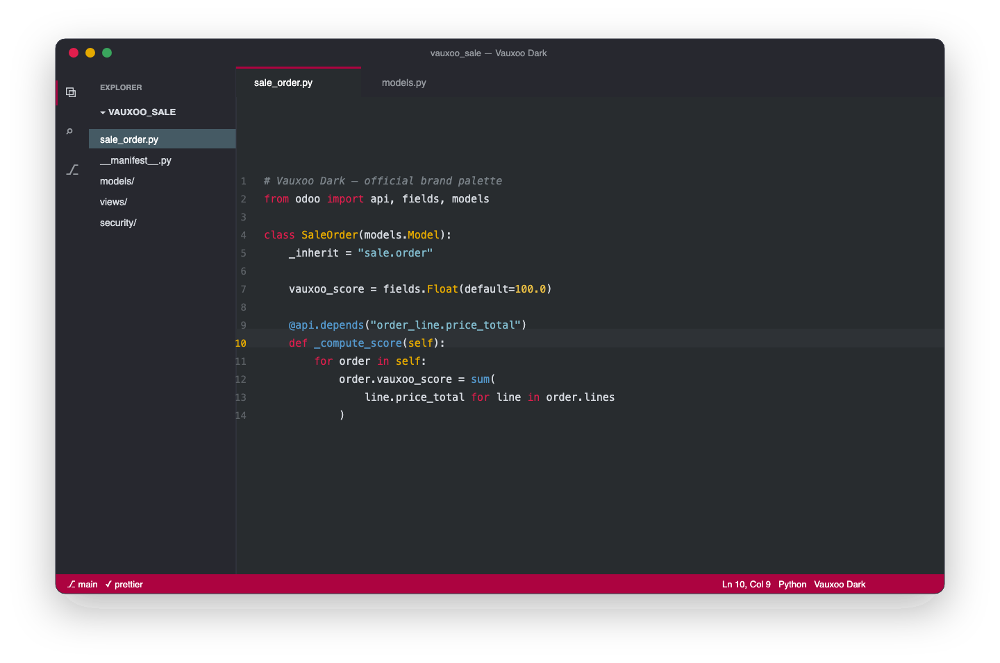
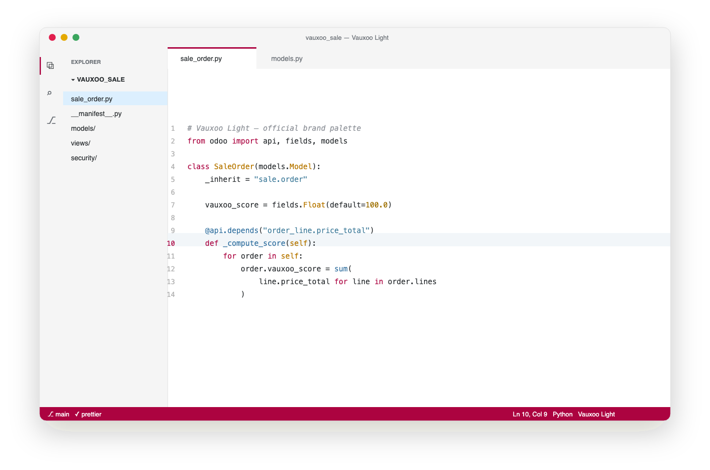
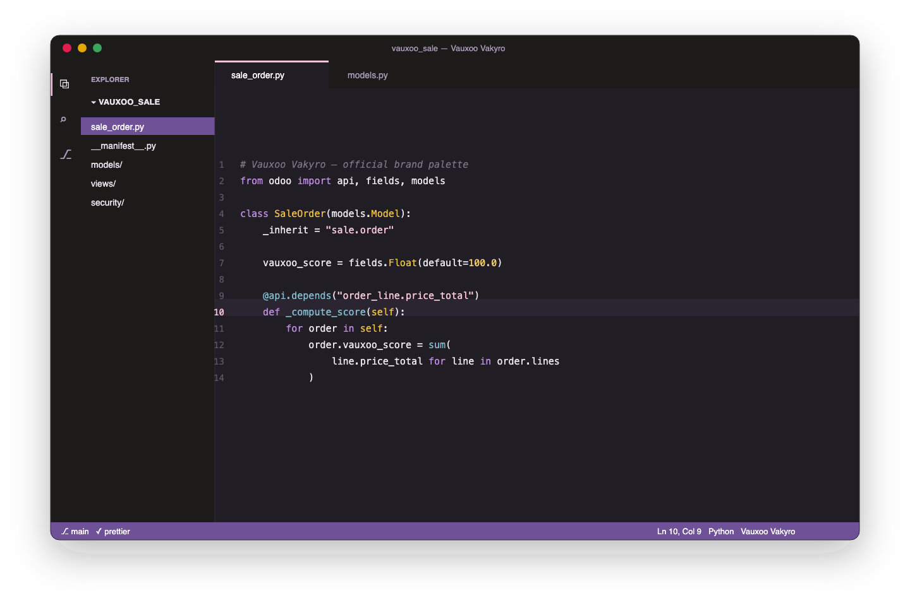
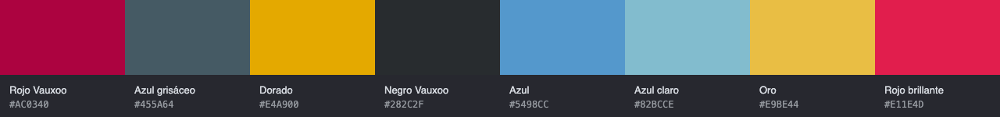

<p align="center">
  
</p>

<h1 align="center">Vauxoo Theme</h1>

<p align="center"><em>Let's Build Something Great</em></p>

<p align="center">
  <a href="https://marketplace.visualstudio.com/items?itemName=vauxoo.vauxoo-theme"></a>
  <a href="https://marketplace.visualstudio.com/items?itemName=vauxoo.vauxoo-theme"></a>
  <a href="LICENSE"></a>
</p>

Three VSCode color themes built on the official [Vauxoo brand palette](https://www.vauxoo.com/assets)
(Brand Manual 2024-2025). Flat design as the manual mandates: no widget
shadows — solid borders and background tints convey hierarchy.

## Vauxoo Dark

Vauxoo black base with the red `#AC0340` on the status bar, buttons, badges
and active tab. Gold cursor.



## Vauxoo Light

Clean white and smoke-gray surfaces, same red identity, blue-gray supporting
accents.



## Vauxoo Vakyro

Inspired by Vakyro, the Vauxoo mascot: warm-black base, purple `#6F5198`
surfaces and status bar, pink `#F3C5D9` cursor and highlights.



## Palette



Syntax follows the brand across all variants: keywords in Vauxoo reds or
purples, strings in light blues or pink, classes in gold, with
green=added / gold=modified / red=deleted semantics in git decorations and
terminal ANSI colors.

## Install

Search **Vauxoo Theme** in the Extensions view, or:

```
code --install-extension vauxoo.vauxoo-theme
```

Then `Cmd+K Cmd+T` (`Ctrl+K Ctrl+T` on Windows/Linux) and pick **Vauxoo
Dark**, **Vauxoo Light** or **Vauxoo Vakyro**.

## License

MIT — see [LICENSE](LICENSE). The Vauxoo name, logo and brand assets belong
to Vauxoo. Screenshots are SVG renders generated from the exact theme tokens
(`images/mockup.py`).

## Warp terminal

The same three palettes ship as [Warp](https://www.warp.dev) themes in
[`warp/`](warp/), in two flavors each:

- `vauxoo-dark.yaml` / `vauxoo-light.yaml` / `vauxoo-vakyro.yaml` — colors only.
- `vauxoo-*-vakyro.yaml` — same palettes **plus Vakyro**, the Vauxoo mascot,
  as a subtle watermark in the terminal background (`*-bg.png`).

### Install on macOS

```sh
git clone https://github.com/Vauxoo/vauxoo-theme
mkdir -p ~/.warp/themes && cp vauxoo-theme/warp/*.yaml vauxoo-theme/warp/*.png ~/.warp/themes/
```

### Install on Linux

```sh
git clone https://github.com/Vauxoo/vauxoo-theme
mkdir -p ~/.local/share/warp-terminal/themes
cp vauxoo-theme/warp/*.yaml vauxoo-theme/warp/*.png ~/.local/share/warp-terminal/themes/
```

### Install on Windows (PowerShell)

```powershell
git clone https://github.com/Vauxoo/vauxoo-theme
New-Item -ItemType Directory -Force "$env:APPDATA\warp\Warp\data\themes" | Out-Null
Copy-Item vauxoo-theme\warp\*.yaml, vauxoo-theme\warp\*.png "$env:APPDATA\warp\Warp\data\themes\"
```

Then in Warp: Settings → Appearance → Theme and pick any **Vauxoo** variant
(the `· Vakyro` ones carry the mascot watermark). The background `.png` files
must sit next to the `.yaml` files — the themes reference them by relative
path.

The colors-only trio is also submitted to the official Warp themes gallery:
[warpdotdev/themes#170](https://github.com/warpdotdev/themes/pull/170).

> Note for VSCode: install works the same on all three OSes from the
> [Marketplace](https://marketplace.visualstudio.com/items?itemName=vauxoo.vauxoo-theme);
> the theme picker is `Cmd+K Cmd+T` on macOS and `Ctrl+K Ctrl+T` on
> Windows/Linux.
